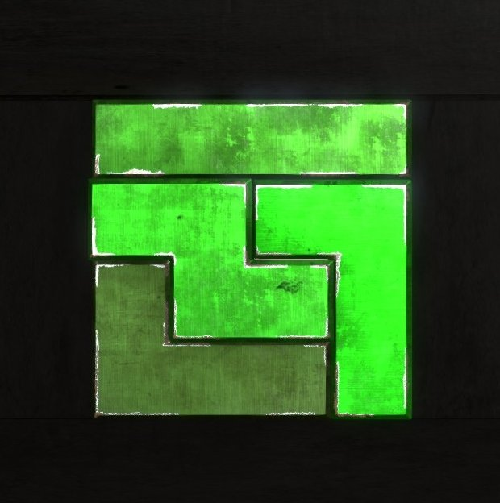

# Description

Sigils is Lua program made for searching for solutions to the problem of placing different shapes onto rectangular grid.

For exmaple, let's say we have 4 Tetris shapes: I, L, J and Z, and we want to place them onto 4x4 grid like so

</img>

The above image is from the game [The Talos Principle](https://store.steampowered.com/app/257510/The_Talos_Principle/) by [Croteam](https://www.croteam.com) which inspired this project (also those Tetris shapes are called sigils in the game, which is the name of the project)

The program has functionality to find all of such placements by doing some "smart" brute forcing

# Usage

## Script Generation

To solve some problem you need to generate script (".bat" or ".sh") that wiil start several processes which will brute force solutions. You also need setup file that specifies grid and shapes that you want to place onto it. Example of such file (`Solve/Setup.lua`):
```Lua
require "Sigils"

grid = Grid.create(4, 4)
shapes = {
    Shapes.Talos.I,
    Shapes.Talos.J,
    Shapes.Talos.Z,
    Shapes.Talos.L,
}
```

You use `Grid.create` to create a grid (in the above example it is 4x4) and some predefined (in `Shapes.lua`) shapes stored in a Lua array

Shape is a table of form:
```Lua
{
    Forms = {
        <matrix>, ...
    },
    Area = <area-obtained-by-the-shape-on-the-grid>,
    UniqueFormsCount = <length-of-Forms>
}
```
For example:
```Lua
S = {
    Forms = {
        {{0, 1, 1},
         {1, 1, 0}},
        
        {{1, 0},
         {1, 1},
         {0, 1}},
    },
    Area = 4,
    UniqueFormsCount = 2
}
```

In `Solve/ScriptGen.lua` `GenerateScript` function is defined. It accepts the following parameters
- `script_filename` - name of output script without an extension 
- `script_type` - type of the script (`ScriptType.Bat` or `ScriptType.Bash`)
- `setup_lua_filename` - name if the file with problem setup information (grid and shapes)
- `start_permutation`, `end_permutaion` - bounds in which to look for solutions (set both to nil if you want to find all of the solutions)
- `number_processes` - number of processes that will run to solve the problem, ranges in which to look for solutions will be derived by cutting the (`start_permutation`, `end_permutaion`) range uniformly

So the call ```GenereteScript("Lonpos", ScriptType.Bat, "Solve/LonposSetup.lua", nil, nil, 12)``` in `Solve/ScriptGen.lua` will generate `Talos.bat` file with the following content:
```Bat
@echo off

set preexec="dofile 'Solve/Setup.lua'; package.path = package.path..';../?.lua;../?'"

start /B lua -e %preexec% Solve\Solve.lua Talos_1 "{1, 2, 3, 4}" "{2, 1, 4, 3}"
start /B lua -e %preexec% Solve\Solve.lua Talos_2 "{2, 3, 1, 4}" "{3, 2, 4, 1}"
start /B lua -e %preexec% Solve\Solve.lua Talos_3 "{3, 4, 1, 2}" "{4, 3, 2, 1}"
```

Running this script will generate 3 files (`solutions_Talos_1.txt`, `solutions_Talos_2.txt`, `solutions_Talos_3.txt`) with the solutions in form: `{<permutation>, <forms>}` where `permutation` is order of shapes defined in setup file and `forms` are indeces of shapes' matrices relatively to permutation.
For example, solution `{{1, 4, 2, 3}, {2, 1, 4, 1}}` for the above setup file means that shapes `{I, J, Z, L}` must be place in order `{1, 4, 2, 3}`, i.e. `{I, L, J, Z}` with forms (which in this case mean rotations) `{2, 1, 4, 1}` respectfully. So the grid is filled in the following way:
```
{{1, 1, 1, 1},
 {2, 3, 3, 3},
 {2, 4, 4, 3},
 {2, 2, 4, 4}}
```

IMPORTANT NOTE: in the aboce example shapes are placed row-wise. That's not always the case. In fact it only happens if grid is a square or number of rows is bigger than number of columns. Otherwise shapes must be placed column-wise. This is done for optimizing the brute forcing.

## FindSolution functions

You probably don't want to search for all of the solutions. Fot that reason there are two functions `FindFirstSolution` and `FindRandomSolution` in `Sigils.lua`. The first one returns first found solution in a specific range, the other one shuffles shapes and apllies previous function. Both functions return tow results: permutation and forms or nil if there are no solutions:
```Lua
require "Sigils"

grid = Grid.create(4, 4)
shapes = {
    Shapes.Talos.I,
    Shapes.Talos.J,
    Shapes.Talos.Z,
    Shapes.Talos.L,
}
-- find first solution starting from permutation {1, 3, 4, 2}
p, f = FindFirstSolution(grid, shapes, {1, 3, 4, 2}) --> {1, 3, 4, 2}, {2, 1, 3, 2}

-- find random solution
p, f = FindRandomSolution(grid, shapes)              --> can be let's say {2, 3, 1, 4}, {3, 2, 1, 4}
```

